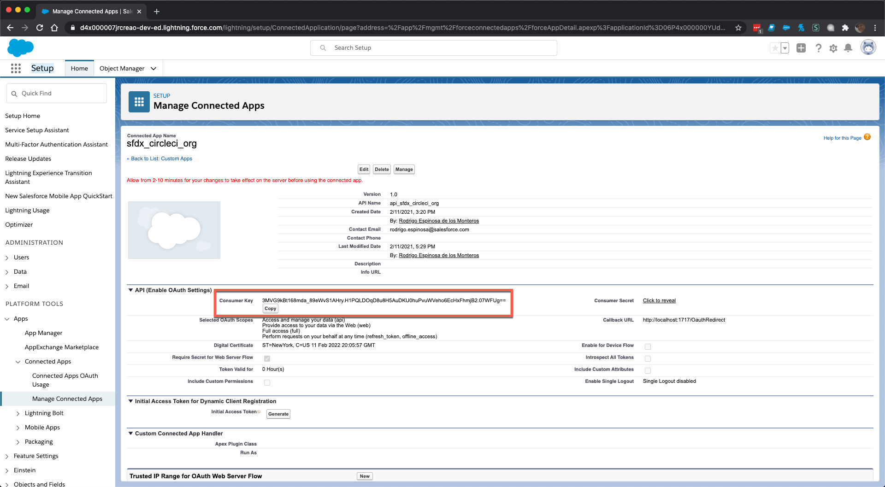
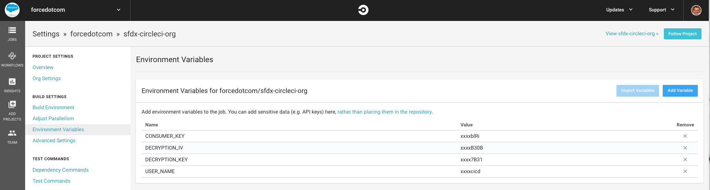

# sfdx-circleci-org 
[](https://circleci.com/gh/forcedotcom/sfdx-circleci-org)


Coming Soon --- For a fully guided walkthrough of setting up and configuring continuous integration using scratch orgs and Salesforce CLI, see the [Continuous Integration Using Salesforce DX](https://trailhead.salesforce.com/modules/sfdx_travis_ci) Trailhead module.

This repository shows how to successfully set up deploying to non-scratch orgs (sandbox or production) with CircleCI. 

## Before You Begin
We make a few assumptions in this README. Continue only if you have completed these critical configuration prerequisites.

- You know how to set up your GitHub repository with CircleCI. (Need help? See the CircleCI [Getting Started guide](https://circleci.com/docs/2.0/).)
- You have properly set up the JWT-Based authorization flow (headless). You can follow [these steps](https://developer.salesforce.com/docs/atlas.en-us.sfdx_dev.meta/sfdx_dev/sfdx_dev_auth_jwt_flow.htm) to set it up.
  - You also need to have the `server.key` you used to setup the the JWT flow above.

## Getting Started
1. [Fork](http://help.github.com/fork-a-repo/) this repo in to your GitHub account using the fork link at the top of the page.

1. Clone your forked repo locally: `git clone https://github.com/<git_username>/sfdx-circleci-org.git`

1. Make sure that you have Salesforce CLI installed. Run `sfdx force --help` and confirm you see the command output. If you don't have it installed, you can download and install it from [here](https://developer.salesforce.com/tools/sfdxcli).

1. Confirm that you can perform a JWT-based auth using your `server.key`: 
    ```bash
    $ sfdx auth:jwt:grant --clientid <your_consumer_key> --jwtkeyfile server.key --username <your_username> --setdefaultdevhubusername
    ```

    **Note:** If you haven't set up JWT-based auth see [Authorize an Org Using the JWT-Based Flow](https://developer.salesforce.com/docs/atlas.en-us.sfdx_dev.meta/sfdx_dev/sfdx_dev_auth_jwt_flow.htm) in the [Salesforce DX Developer Guide](https://developer.salesforce.com/docs/atlas.en-us.sfdx_dev.meta/sfdx_dev).

1. Encrypt and store your `server.key` using the instructions below.  
    ***IMPORTANT!*** - For security reasons, don't store the `server.key` within the project.

    1. First, generate a `key` and an initializtion vector (`iv`) to encrypt your `server.key` file locally
    (CircleCI will use the them to decrypt your `server.key` in the build environment).

        ```bash
        $ openssl enc -aes-256-cbc -k <passphrase here> -P -md sha1 -nosalt
        ```

    1. Make note of the `key` and `iv` values output to the screen. You'll use them to encrypt your `server.key` in the next step.

    1. Encrypt the `server.key` using the newly generated `key` and `iv` values. Use the `key` and `iv` values *only once*, and don't use them to encrypt more than the `server.key`.  While you can re-use this pair to encrypt other things, it's considered a security violation to do so. Every time you run the command above, a new `key` and `iv` value is generated. You can't regenerate the same pair, so if you lose these values you'll need to generate new ones and encrypt again.

        ```bash
        $ openssl enc -nosalt -aes-256-cbc -in server.key -out assets/server.key.enc -base64 -K <key> -iv <iv>
        ```
        This command replaces the existing `server.key.enc` with your encrypted version.

7) From your JWT-based connected app on Salesforce, retrieve the generated `Consumer Key` and store it in a CircleCI environment variable named `CONSUMER_KEY` using the CircleCI UI.

    

8) Store the user name that you use to access your target org in a CircleCI environment variable named `USER_NAME`. 
**Note** - this is the username that you use to log in to your target org.

9) Store the endpoint that you use to login your target org in a CircleCI environment variable named `ENDPOINT`. **Note** - this is the endpoint that you use to log in to your target org (e.g. login.salesforce.com).

10) Store the `key` and `iv` values in CircleCI environment variables named `DECRYPTION_KEY` and `DECRYPTION_IV`, respectively.  When finished setting environment variables, the environment variables setup screen should look like the one below.

    

11) Commit the updated `server.key.enc` file.

Now you're ready to go! When you commit and push a change, your change kicks off a CircleCI build.

Enjoy!

## Contributing to the Repository ###

If you find any issues or opportunities for improving this repository, fix them! Feel free to contribute to this project by [forking](http://help.github.com/fork-a-repo/) this repository and making changes to the content. Once you've made your changes, share them back with the community by sending a pull request. See [How to send pull requests](http://help.github.com/send-pull-requests/) for more information about contributing to GitHub projects.

## Reporting Issues ###

If you find any issues with this demo that you can't fix, feel free to report them in the [issues](https://github.com/forcedotcom/sfdx-circleci-org/issues) section of this repository.
